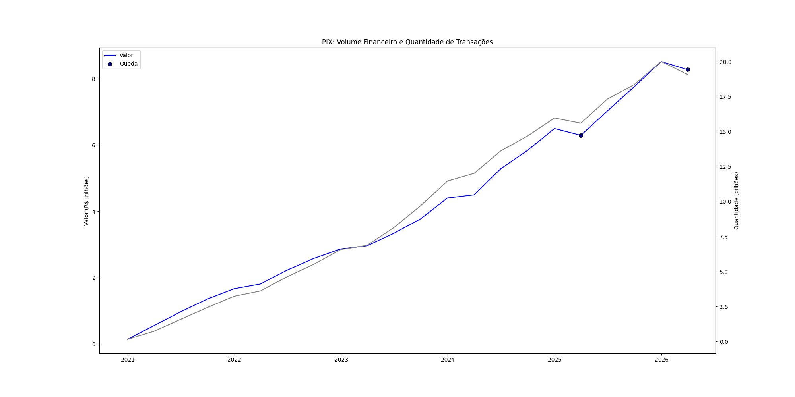

# PIX Adoption Analysis in Brazil
How PIX became Brazil's go-to payment method, moving trillions in just 5 years.

## Context
PIX is an instant payment system created by the Banco Central do Brasil (BCB) in November 2020. Its main differentiator is interoperability — any bank, fintech, or individual can participate under the same open framework, creating a seamless and efficient payment environment across institutions.

## Data Source
Data collected via the BCB Open Data API, which returns PIX transaction statistics in JSON format. The dataset is publicly available, reflecting the BCB's commitment to transparency in the Brazilian payments market.

→ [BCB Open Data API](https://olinda.bcb.gov.br/olinda/servico/Pix_DadosAbertos/versao/v1/odata/EstatisticasTransacoesPix)

## Methodology
The project is structured in three stages:

- **collect** — fetch raw data from BCB API
- **clean** — aggregate 673k granular rows into 27 monthly records, convert date types
- **analyze** — compute month-over-month growth rates and key metrics
- **visualize** — build a dual-axis chart with historical data, trend annotations, and linear projection

## Key Findings
- PIX recorded **314% growth** in transaction volume in December 2020 — its first full month of operation
- In just 5 years, PIX became Brazil's largest payment method, moving **R$ 8+ trillion per quarter**
- **Q1 2025 anomaly**: the only significant adoption drop coincided with viral fake news claiming PIX would be taxed. Despite government denials, transactions fell ~15% before recovering within weeks — a clear example of how misinformation impacts financial behavior
- Linear regression projects PIX reaching **R$ 9.8 trillion** in quarterly volume by end of 2027

## How to Run
```bash
git clone https://github.com/joaoschramm0/fintech-brazil-analysis.git
cd fintech-brazil-analysis
pip install -r requirements.txt
python src/collect.py
python src/clean.py
python src/visualize.py
```

## Chart
